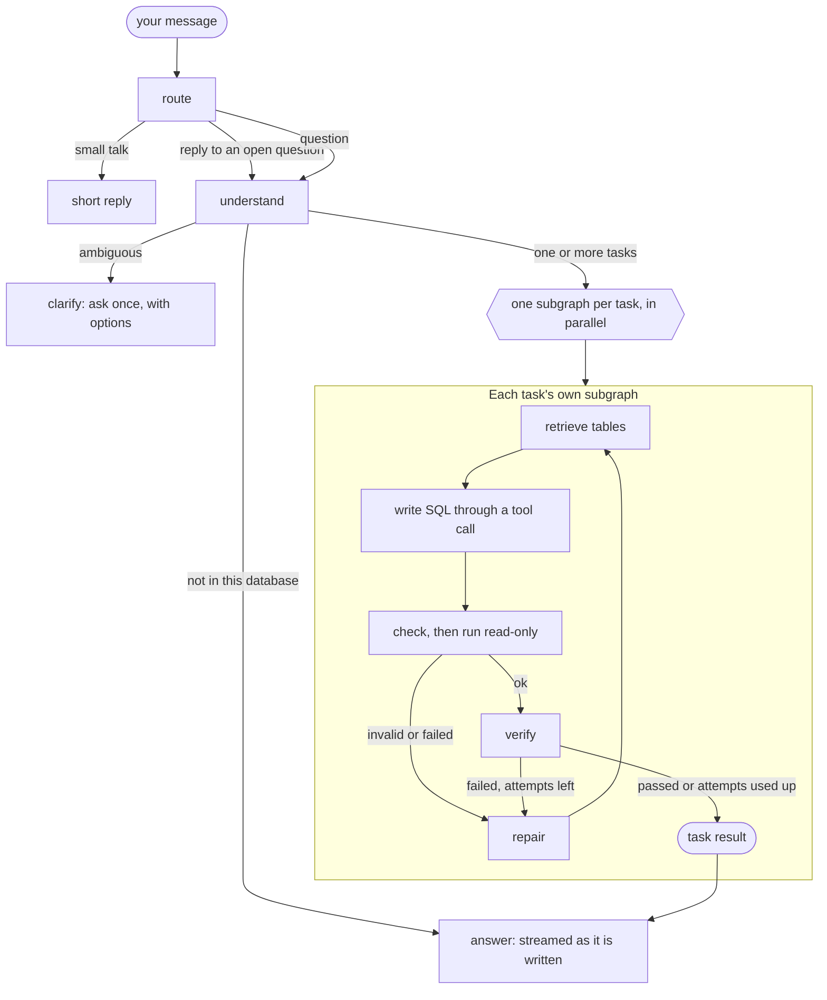

<div align="center">


<h3>Ask your PostgreSQL or MySQL database questions in plain language.</h3>

<p>
Bring your own database and any OpenAI-compatible model. Chinhook finds the tables a question needs,<br>
writes read-only SQL, checks it, runs it, verifies the result, and streams back an answer<br>
that shows exactly how it was produced.
</p>

<p>
<a href="https://chinhook.vercel.app"><strong>Open the live app</strong></a>
&nbsp;·&nbsp;
<a href="#deploy-your-own">Deploy your own</a>
&nbsp;·&nbsp;
<a href="#how-it-works">How it works</a>
&nbsp;·&nbsp;
<a href="#troubleshooting">Troubleshooting</a>
&nbsp;·&nbsp;
<a href="SECURITY.md">Security</a>
</p>

<a href="https://chinhook.vercel.app"></a>


<br>


<a href="LICENSE"></a>

</div>

<br>

<p align="center">
  
</p>

---

## Contents

- [Highlights](#highlights)
- [A closer look](#a-closer-look)
- [Using the app](#using-the-app)
- [What happens to your data](#what-happens-to-your-data)
- [How it works](#how-it-works)
- [Supported databases and models](#supported-databases-and-models)
- [Deploy your own](#deploy-your-own)
- [Configuration](#configuration)
- [Project structure](#project-structure)
- [Security and reliability](#security-and-reliability)
- [Troubleshooting](#troubleshooting)
- [Limitations](#limitations)
- [Contributing](#contributing)
- [License and credits](#license-and-credits)

---

## Highlights

<table>
<tr>
<td width="50%" valign="top">

### 🔌 Bring your own database and model
Connect PostgreSQL or MySQL and any OpenAI-compatible endpoint on the setup screen. Nothing is configured in code, and nothing you enter is stored.

</td>
<td width="50%" valign="top">

### 🔒 Read-only, enforced by the database
Every connection the app opens is a read-only session, so a write fails at the database itself, even with a login that could write.

</td>
</tr>
<tr>
<td valign="top">

### 🧭 Built for real schemas
The schema is searched, not pasted into a prompt: hybrid dense and lexical search over an index of your tables, expanded along foreign keys, plus an index of real values that turns "Americans" into `country = 'USA'`.

</td>
<td valign="top">

### 🔍 Every answer shows its work
Each answer comes with the tables that were searched, the SQL that ran, the rows it returned, the time each step took and the tokens it cost.

</td>
</tr>
<tr>
<td valign="top">

### 🤔 Asks instead of guessing
If a question could mean two things ("How many Americans?": customers or employees?), Chinhook asks once and offers the options to pick from.

</td>
<td valign="top">

### ⚡ Compound questions, in parallel
A message holding several questions becomes several tasks. Each gets its own SQL, checks and retries, and they all run at the same time.

</td>
</tr>
<tr>
<td valign="top">

### ✅ Verified before it is reported
Results are checked against what was asked: a "top 5" returns at most five rows, and a count returns one number. A failed check is repaired with the reason fed back.

</td>
<td valign="top">

### 🧹 Keeps only what it needs
Credentials live in your browser session only. The index of your schema expires after 7 days without use, or is deleted the moment you ask.

</td>
</tr>
</table>

---

## A closer look

<table>
<tr>
<td width="50%" valign="top">

<p align="center"><b>Start</b>: the pipeline every question goes through, and questions to try</p>
</td>
<td width="50%" valign="top">

<p align="center"><b>See how</b>: time per step, tables retrieved, the exact SQL</p>
</td>
</tr>
<tr>
<td valign="top">

<p align="center"><b>Clarify</b>: an ambiguous question is asked back once</p>
</td>
<td valign="top">

<p align="center"><b>Explore</b>: every table and view, read live from the database</p>
</td>
</tr>
</table>

<table>
<tr>
<td width="62%" valign="middle">

### 📱 Works on a phone, and survives a dropped connection

- The chat input stays pinned to the bottom of the screen, and each new answer scrolls into view as it streams in.
- Chat and Schema are separate pages in the sidebar, so switching between them keeps your conversation.
- If the connection drops (Wi-Fi blips, a laptop sleeps), you have **five minutes** to come back to the same session, with your connection settings and chat intact.

</td>
<td width="38%" align="center">

</td>
</tr>
</table>

---

## Using the app


1. **Open the app**: the [live instance](https://chinhook.vercel.app), or [your own deployment](#deploy-your-own).
2. **Connect your database.** Pick PostgreSQL or MySQL, then paste the connection URL your provider gives you, or fill in the separate fields.
   - For PostgreSQL, choose the schema to answer from (`public` by default).
   - **SSL**: `prefer` encrypts when the server supports it, `require` always encrypts, and `disable` never does. An `sslmode` written in the URL itself takes precedence.
   - The database must be **reachable from the internet**, because the app connects to it from its server.
   - A login that can only read is recommended. The setup screen shows the SQL to create one.
3. **Choose your model.** Pick a provider preset, or **Other** for any OpenAI-compatible base URL, then enter your API key and a model name. The model must support **tool (function) calling**. Under *Advanced*, an optional cheaper *fast model* writes the table descriptions during indexing.
4. **Connect.** The app logs in to your database for real, checks that it can see your tables, and checks that the model answers and calls tools. If anything fails, it tells you what to change.
5. **Wait for indexing, once.** The first time a database is connected, each table is read, your model describes it in one sentence, and the description is indexed. Reconnecting later reuses the index. **Refresh index** re-indexes only the tables that changed.
6. **Ask.** Under every answer, **How this answer was produced** shows the pipeline, the tables, the SQL, the rows and the tasks the question became.

The sidebar shows what is connected and the state of the index. It also holds **New chat**, **Change connection** and, under *Your data*, **Delete this database's index**, which removes everything the server holds about your database.

<br clear="right">

> [!TIP]
> No database handy? Load the [Chinook sample database](https://github.com/lerocha/chinook-database) (a music store with artists, albums, tracks, customers and invoices) into a free hosted PostgreSQL or MySQL, then connect to it. The screenshots in this README use it.

---

## What happens to your data

| What | Where it goes | How long |
|---|---|---|
| Your database URL, login and password, and your model API key | The server's memory, for your browser session only | Until you close the tab or change the connection. A dropped connection is held for five minutes so it can resume. Never written to disk, a database or the page URL |
| Your database | Read by read-only queries only. Nothing is ever written to it | n/a |
| The index: table and column names, a one-line description of each table, and common values of category-like columns (countries, statuses, genres) | The deployment's Qdrant | Deleted after `INDEX_RETENTION_DAYS` without use (7 by default), or immediately with **Delete this database's index** |
| Your questions, the relevant part of your schema and the rows a query returns, plus a few sample rows per table at index time | Your model provider, through the API key you gave | As long as that provider keeps them |

Columns that look like contact details (email, phone, address, names) are masked as `[redacted]` in the sample rows sent to the model, and they are never indexed as values.

---

## How it works



An ordinary question costs **three model calls**: understanding the question, writing SQL (once per task) and writing the answer (streamed).

1. **Route.** Small talk and replies to an open clarifying question are recognised without a model call.
2. **Understand.** One call reads the message against the conversation and the slice of the schema retrieved for it. It splits a compound question into independent tasks and decides whether something has to be asked first.
3. **Retrieve.** Each task runs a hybrid search over the index: dense embeddings combined with word overlap with table and column names. The results are expanded with the tables on the foreign-key path between the ones that matched. A second index of real values maps the user's words to what is actually stored.
4. **Generate.** The model writes one `SELECT` through a tool call, given only the retrieved slice of the schema.
5. **Check and run.** The query is parsed with [`sqlglot`](https://github.com/tobymao/sqlglot) in your database's dialect. It must be one statement, a `SELECT` only, using real tables only, with nothing from the forbidden list. It runs in a read-only transaction with a 10-second limit and a 500-row cap.
6. **Verify.** Deterministic checks: did it run, does the result have the shape that was asked for, does it read the table the question was about. A failure is repaired with its reason fed back, up to a bounded number of attempts.
7. **Answer.** The answer is written only from verified results and streamed as it is written. A multi-row result's table is built from the verified rows themselves, not retyped by the model.

### Architecture


- **One runtime per browser session.** It holds that session's database and model settings, in memory only, and every call made on the session's behalf uses it.
- **One connection pool per database.** Every connection in it is switched to read-only before anything else runs on it.
- **One pair of Qdrant collections per database.** They are named `chinhook_<16 hex>_tables` and `_values` from a hash of the database, schema, user and embedding model. No session can read another database's index, and reconnecting to the same database reuses its index.
- **Embeddings run inside the app** with [fastembed](https://github.com/qdrant/fastembed) (`BAAI/bge-small-en-v1.5` by default, baked into the image at build time), so visitors only need to bring a chat model.

---

## Supported databases and models

### Databases

**PostgreSQL** and **MySQL**, including their hosted forms: Supabase, Neon, Prisma Postgres, Amazon RDS and Aurora, Google Cloud SQL, Azure Database, Railway, Render, PlanetScale and others. Tested on PostgreSQL 18 and MySQL 8.4. MariaDB should work, but it is less tested.

- **Views**, **mixed-case names** and **non-`public` PostgreSQL schemas** are supported.
- MySQL logins that use `caching_sha2_password` (the MySQL 8 default) work out of the box.
- The database must accept connections from the internet. `localhost` and private networks are refused on a public deployment (see [Security](#security-and-reliability)).

### Models

Any endpoint that speaks the OpenAI Chat Completions API and supports **tool calling**:

| Provider | Base URL | Model |
|---|---|---|
| OpenAI | `https://api.openai.com/v1` | e.g. `gpt-4.1-mini` |
| Azure OpenAI | `https://<resource>.openai.azure.com/openai/v1` | **your deployment name** |
| OpenRouter | `https://openrouter.ai/api/v1` | e.g. `openai/gpt-4.1-mini` |
| Groq | `https://api.groq.com/openai/v1` | a tool-calling model |
| Google Gemini | `https://generativelanguage.googleapis.com/v1beta/openai` | e.g. `gemini-2.5-flash` |
| Anthropic | `https://api.anthropic.com/v1` | e.g. a Claude Sonnet model |
| Mistral | `https://api.mistral.ai/v1` | e.g. `mistral-large-latest` |
| Other | any OpenAI-compatible `/v1` URL (Together, Fireworks, DeepSeek, a self-hosted vLLM, …) | as that server names it |

> [!NOTE]
> **Azure OpenAI:** enter the **v1 base URL** above, not a full `…/openai/deployments/<name>/chat/completions?api-version=…` address, and use your **deployment name** as the model. The key must come from the same Azure resource.

Endpoint quirks are handled automatically. These include reasoning models that refuse `temperature`, servers that only accept `max_tokens`, and servers that reject `stream_options`.

---

## Deploy your own

A deployment is two services:

| Service | What it is | Public? |
|---|---|---|
| **App** | This repository's `Dockerfile`: the Streamlit page, the agent, and the embedding model running in-process | Yes |
| **Qdrant** | The vector index, `qdrant/qdrant` | **No**, and it never needs to be |

Nothing else runs on the server side, because visitors bring their own database and model key.

> [!IMPORTANT]
> The app is a long-running Python server that keeps a WebSocket open to every browser, so it needs an **always-on container host**: Railway, Render, Fly.io, a VM, or anything else that runs Docker. Function or serverless platforms such as Vercel cut the connection every few minutes and lose sessions. See [Why not Vercel](#why-not-vercel-or-other-function-platforms).

### On Railway (recommended)

<details open>
<summary><b>1. Create the Qdrant service</b></summary>

<br>

1. In a Railway project: **New → Docker Image** → `qdrant/qdrant:v1.19.1`.
2. **Settings → Volumes**: add a volume mounted at `/qdrant/storage`, so indexes survive a redeploy.
3. **Variables**:

   ```dotenv
   # Qdrant refuses every request without this key. Use a long random string,
   # for example the output of: openssl rand -hex 32
   QDRANT__SERVICE__API_KEY=<a-long-random-string>

   # Listen on IPv6 as well as IPv4. Railway's private network is IPv6-only in some
   # environments, and Qdrant listens on IPv4 alone by default.
   QDRANT__SERVICE__HOST=::
   ```

4. **Do not** generate a public domain for it. The app reaches it over Railway's private network.

</details>

<details open>
<summary><b>2. Create the app service</b></summary>

<br>

1. **New → GitHub Repo** → this repository (or your fork) and the branch to deploy. Railway finds the `Dockerfile` and builds it.
2. **Variables**. Railway fills in the `${{…}}` references from the Qdrant service; replace `Qdrant` with your Qdrant service's exact name.

   ```dotenv
   QDRANT_URL=http://${{Qdrant.RAILWAY_PRIVATE_DOMAIN}}:6333
   QDRANT_API_KEY=${{Qdrant.QDRANT__SERVICE__API_KEY}}

   # Optional: the defaults are shown
   INDEX_RETENTION_DAYS=7
   MAX_INDEX_TABLES=200
   MAX_CONCURRENT_INDEX_JOBS=2
   RATE_LIMIT_PER_SESSION_PER_MINUTE=10
   RATE_LIMIT_GLOBAL_PER_MINUTE=120
   # APP_PASSPHRASE=a shared passphrase in front of the whole app
   ```

3. **Settings → Networking → Generate Domain** (or attach your own domain).
4. **Settings → Deploy → Healthcheck Path**: `/_stcore/health`.
5. Give it **at least 1 GB of memory**. The embedding model, Streamlit and a couple of concurrent indexing jobs together use most of that.
6. Keep it at **one replica**. Each browser's session lives in the memory of the process it connected to.

Railway sets `PORT`, and the app listens on it.

</details>

<details open>
<summary><b>3. Check it</b></summary>

<br>

Open the app's domain, connect a database and a model, and ask a question. The first time a database is connected, Qdrant's logs show the collections `chinhook_<16 hex>_tables` and `chinhook_<16 hex>_values` being created, next to `chinhook__registry`, which retention uses to track when each index was last used.

</details>

### Anywhere else that runs Docker

The image is the same everywhere: set the variables above, let the platform route to `$PORT` (8501 when it sets none), and point its health check at `/_stcore/health`.

```bash
docker build -t chinhook .
docker run -d --name chinhook -p 8501:8501 \
  -e QDRANT_URL=https://<your-cluster>.cloud.qdrant.io:6333 \
  -e QDRANT_API_KEY=<your-qdrant-key> \
  chinhook
```

- **Render**: create a *Web Service* from the repository.
- **Fly.io**: `fly launch` picks up the `Dockerfile`.
- **Qdrant elsewhere**: the app only knows Qdrant as `QDRANT_URL` and `QDRANT_API_KEY`, so moving it to [Qdrant Cloud](https://cloud.qdrant.io) or another host changes only those two variables. Existing indexes don't need to move: a database whose index is missing is simply indexed again when it connects. For an `https://` URL without a port, port 443 is used.

### Keeping a Vercel address

The root [`vercel.json`](vercel.json) turns a Vercel project into a redirect to the app, which is how `chinhook.vercel.app` points at the Railway deployment.

- It sets the framework to "Other" with no install or build step, which overrides whatever preset the Vercel project has.
- It serves the small fallback page in [`deploy/vercel/`](deploy/vercel/index.html).
- It redirects every path to the app.

To point it at your own deployment:

1. Replace the app address in both redirect rules of `vercel.json` and in `deploy/vercel/index.html`. There are two rules because `/:path*` does not match the bare `/`.
2. Leave the Vercel project's **Root Directory** at the repository root, so Vercel reads that file.
3. Redeploy. `curl -I https://<your-project>.vercel.app` should answer `307`, with a `location` header pointing at the app.

### Why not Vercel or other function platforms

Vercel can run this `Dockerfile` as a container function, and that was tried first. Its logs showed why it doesn't work for this app:

- **The live connection is cut every 5 minutes.** A function invocation ends at the plan's time limit (300 seconds on Hobby), and the browser's WebSocket ends with it. Each cut freezes the tab while it reconnects.
- **One browser's requests reach several copies of the app.** Streamlit keeps each visitor's session (their connection settings and their chat) in one process's memory. A reconnect that lands on another copy starts over at the setup screen.

An always-on container keeps one process for every session, and a dropped connection comes back to the same session for five minutes (`server.disconnectedSessionTTL` in [`.streamlit/config.toml`](.streamlit/config.toml)).

### Operator checklist

- [ ] Qdrant has `QDRANT__SERVICE__API_KEY` set and **no public domain**.
- [ ] The app's `QDRANT_API_KEY` matches it (a reference variable keeps them in sync).
- [ ] The healthcheck path is `/_stcore/health`; the app has one replica and at least 1 GB of memory.
- [ ] Rate limits and `MAX_INDEX_TABLES` suit how much load the server can take.
- [ ] `INDEX_RETENTION_DAYS` matches what you tell visitors about how long their index is kept.
- [ ] Any key that has ever been pasted somewhere public has been rotated.

---

## Configuration

Everything below belongs to whoever runs the deployment and is read from environment variables. Visitors' databases and models are never configured here.

| Variable | Default | Purpose |
|---|---|---|
| `QDRANT_URL` | **required** | Where Qdrant is, e.g. `http://qdrant.railway.internal:6333`. Without it, the page shows a clear configuration error |
| `QDRANT_API_KEY` | — | Qdrant's API key (its `QDRANT__SERVICE__API_KEY`). Set it whenever Qdrant is reachable over a network |
| `QDRANT_COLLECTION_PREFIX` | `chinhook` | Prefix of every collection the app creates, so a shared Qdrant stays tidy and retention never touches anything else |
| `EMBED_MODEL` | `BAAI/bge-small-en-v1.5` | [fastembed](https://github.com/qdrant/fastembed) model for the index. Changing it is safe: indexes are rebuilt as databases reconnect |
| `FASTEMBED_CACHE_PATH` | `/app/.cache/fastembed` (in the image) | Where the embedding model is cached. The image downloads the default model there at build time |
| `INDEX_RETENTION_DAYS` | `7` | Days an unused index is kept. `0` keeps indexes forever |
| `MAX_INDEX_TABLES` | `200` | Databases with more tables and views than this are refused rather than indexed |
| `MAX_CONCURRENT_INDEX_JOBS` | `2` | How many databases may be indexing at once |
| `APP_PASSPHRASE` | — | Optional shared passphrase in front of the whole app |
| `RATE_LIMIT_PER_SESSION_PER_MINUTE` | `10` | Questions per browser session per minute |
| `RATE_LIMIT_GLOBAL_PER_MINUTE` | `120` | Questions across all sessions per minute |
| `PORT` | `8501` | The port to listen on. Railway and most platforms set it themselves |

---

## Project structure

```text
.
├── app.py                    # The Streamlit page: setup, indexing, and the Chat and Schema pages
├── chinhook/                 # Everything app.py calls
│   ├── chat_engine.py        #   The one entry point the page uses: answer, index, schema
│   ├── connection.py         #   Setup: reading what was typed, the public-host guard, checks
│   ├── runtime.py            #   The database and model one browser session is connected to
│   ├── config.py             #   The deployment's own settings, from environment variables
│   ├── rate_limit.py         #   Per-session and global limits
│   ├── agent/                #   The LangGraph workflow
│   │   ├── graph.py          #     Parent graph: routing, parallel tasks, timing
│   │   ├── task_graph.py     #     One task: retrieve, write SQL, check and run, verify, repair
│   │   ├── llm.py            #     OpenAI-compatible model calls, streaming, token accounting
│   │   ├── router.py         #     Routing that needs no model call
│   │   ├── schema.py         #     Per-database catalog cache and schema retrieval
│   │   ├── verify.py         #     Deterministic result checks
│   │   ├── state.py          #     Typed workflow and session state
│   │   └── nodes/            #     route, understand, clarify, greeting, answer, prompts
│   ├── db/                   #   Database access and the vector index
│   │   ├── clients.py        #     Per-database connection pools, Qdrant, embeddings
│   │   ├── dialects.py       #     What differs between PostgreSQL and MySQL
│   │   ├── introspection.py  #     Tables, views, columns, foreign keys, row estimates
│   │   ├── indexing.py       #     Building and updating the index
│   │   ├── fingerprinting.py #     Whether the index still matches the database
│   │   ├── retrieval.py      #     Hybrid table search and value search
│   │   ├── evidence.py       #     The one-line description of each table
│   │   ├── values.py         #     Which column values are worth indexing
│   │   ├── pii.py            #     Columns treated as contact details
│   │   ├── retention.py      #     Expiring indexes nobody uses
│   │   └── sql.py            #     SQL validation and read-only execution
│   └── ui/
│       ├── render.py         #     Markdown rendering and sanitising, the pipeline diagram
│       └── styles.css        #     The page's styles
├── static/                   # Served at app/static/: the banner and icon (screenshots are for this README only)
├── .streamlit/config.toml    # Theme, static file serving, how long a dropped session is kept
├── deploy/vercel/            # The fallback page for the Vercel redirect
├── vercel.json               # Makes a Vercel project a redirect to the app
├── Dockerfile                # The image Railway, or any Docker host, runs
├── pyproject.toml, uv.lock   # Dependencies, locked
├── LICENSE, NOTICE           # Apache 2.0, plus the credit and naming terms every copy keeps
└── SECURITY.md               # How to report a vulnerability
```

---

## Security and reliability

- **Read-only at the database.**
  - PostgreSQL sessions run every transaction as `READ ONLY`.
  - MySQL sessions are set to `SET SESSION TRANSACTION READ ONLY`, and each borrowed connection starts with `START TRANSACTION READ ONLY`.
  - A write fails at the database even with a superuser login, even if every check above it were fooled.
- **SQL validation.**
  - One statement only: a `SELECT`, or a `UNION`/`INTERSECT`/`EXCEPT` of them.
  - The whole syntax tree is walked for writes hidden in CTEs, as well as `INTO`, `SET`, `COPY` and `GRANT`.
  - Each dialect has its own forbidden functions:
    - PostgreSQL: `pg_sleep`, `pg_read_file`, `dblink` and more.
    - MySQL: `SLEEP`, `BENCHMARK`, `LOAD_FILE`, `GET_LOCK` and more.
- **Only your schema.** A query may read only the tables and views of the connected schema. The database's own catalog is also allowed, so questions about the database itself can be answered.
- **Bounded.**
  - Each query has a 10-second limit and returns at most 500 rows. A cut-off result is flagged, never presented as complete.
  - Repair attempts are bounded.
  - There are limits on the tables indexed and on concurrent indexing jobs.
  - Questions are rate-limited per session and globally, and setup attempts are rate-limited too.
- **Can't reach the server's own network.**
  - Database hosts and model URLs must resolve to public addresses.
  - `localhost`, private and link-local ranges, cloud metadata addresses, and names like `qdrant.railway.internal` are refused.
  - The check runs again whenever a new connection pool is opened, and the model client never follows redirects.
- **Isolation between visitors.** Connection settings, chat history and schema caches are per session. Connection pools, model clients (keyed by a hash of the API key) and Qdrant collections are per database or per key. None of them are shared between visitors.
- **Sanitised output.** Answers are Markdown rendered through an allowlist HTML sanitiser ([nh3](https://github.com/messense/nh3)), so neither a model's reply nor a value in your data can inject script into the page.
- **Optional gate.** `APP_PASSPHRASE` puts one shared passphrase in front of the whole app. It is compared in constant time.

Found a security problem? Please report it privately, as described in [SECURITY.md](SECURITY.md).

---

## Troubleshooting

<details>
<summary><b>"Something is wrong with this deployment … <code>QDRANT_URL is not set</code>"</b></summary>

<br>

The app service has no `QDRANT_URL`. Set it on the **app** service (not on Qdrant), for example `http://${{Qdrant.RAILWAY_PRIVATE_DOMAIN}}:6333` on Railway, then redeploy.

</details>

<details>
<summary><b>"The search index (Qdrant) at … could not be reached" or <code>timed out</code></b></summary>

<br>

- Use the **private** address with the scheme and port: `http://<qdrant-service>.railway.internal:6333`. A bare `qdrant.railway.internal:6333` without `http://` is not a URL.
- Add `QDRANT__SERVICE__HOST=::` to the **Qdrant** service and redeploy it. Some Railway private networks are IPv6-only, and Qdrant listens on IPv4 alone by default.
- Make sure the app's `QDRANT_API_KEY` is the same value as Qdrant's `QDRANT__SERVICE__API_KEY`. A reference variable (`${{Qdrant.QDRANT__SERVICE__API_KEY}}`) keeps them in sync.
- If you really must use Qdrant's *public* domain, use `https://<domain>` with **no port**. Railway's public domains serve on 443, not on 6333.

</details>

<details>
<summary><b>"<i>host</i> is not a public address"</b></summary>

<br>

The app connects to your database and model from its own server, so both must be reachable from the internet. `localhost`, private IPs and internal names such as `*.railway.internal` are refused on purpose. Use the public host your provider gives you. On Railway, for example, that is the database's *public* TCP proxy address.

</details>

<details>
<summary><b>"Connected, but schema "public" has no tables or views this login can read"</b></summary>

<br>

The login worked, but there is nothing to answer from:

- The tables live in another schema. Enter that schema on the setup screen.
- The database is still empty. A freshly created hosted database, a Prisma Postgres instance before its first migration for example, has no tables until you create or migrate them.
- The login has no `SELECT` grant on the tables. The setup screen shows the SQL to grant it.

</details>

<details>
<summary><b>"The API key was rejected" (especially with Azure OpenAI)</b></summary>

<br>

- Check that the key belongs to the provider whose base URL you entered.
- For **Azure OpenAI**, use `https://<resource>.openai.azure.com/openai/v1` as the base URL and your **deployment name** as the model, with a key from that same resource. Don't paste a full `…/deployments/…/chat/completions?api-version=…` address.

</details>

<details>
<summary><b>"The model was not found at this base URL"</b></summary>

<br>

The model name doesn't exist at that endpoint. Use the provider's exact model ID (or, on Azure, the deployment name), and make sure the base URL is the provider's OpenAI-compatible root, usually ending in `/v1`.

</details>

<details>
<summary><b>The tab freezes, or goes back to the setup screen after a few minutes</b></summary>

<br>

The app is running on a function or serverless platform that cuts connections and spreads requests over several copies. Run it on an always-on container host instead; see [Why not Vercel](#why-not-vercel-or-other-function-platforms). A short drop of five minutes or less on an always-on host resumes the same session.

</details>

<details>
<summary><b>Vercel: "Found app.py but it does not export a top-level app, application or handler"</b></summary>

<br>

Vercel is trying to build the app as a Python function. Keep the root [`vercel.json`](vercel.json): it overrides the project's framework preset and turns the deployment into a redirect. Renaming `app.py` does not help; it only changes the error to "No python entrypoint found".

</details>

<details>
<summary><b>"Too many attempts in a short time" or a question-rate message</b></summary>

<br>

You've reached a rate limit. Wait the number of seconds shown and try again. Operators can raise the limits with `RATE_LIMIT_PER_SESSION_PER_MINUTE` and `RATE_LIMIT_GLOBAL_PER_MINUTE`.

</details>

---

## Limitations

- Retrieval is only as good as the index. A table with an unhelpful name and no distinguishing sample data is harder to find.
- Dependencies between the tasks of one message are limited: a filter can be shared from one task's question to another's, but tasks don't share actual query results.
- Row counts on the Schema page come from the database's statistics and are approximate.
- Sessions live in the memory of one app process. Run one replica; a restart or redeploy asks everyone to connect again, but indexes are kept.
- Databases must be reachable from the internet. There is no SSH tunnel or private-network option for visitors' databases.
- The optional login is one shared passphrase, not per-user accounts.

---

## Contributing

Issues and pull requests are welcome, and contributions are accepted under the same Apache 2.0 license. This branch is the **deployment** branch: it holds exactly what runs in production and nothing for local tooling, so keep changes here deployable as they are. Please report security problems privately, as described in [SECURITY.md](SECURITY.md).

---

## License and credits

Released under the [Apache License 2.0](LICENSE). © 2026 Mahmoud Refaey and the Chinhook contributors.

You may use, modify and redistribute the code, including commercially. Any copy or derivative must keep the copyright and the [NOTICE](NOTICE) file, which credits the original. The license covers the code, not the names: **"Chinhook", its icon and banner, and the GBG Global Brands Group name and logo are not licensed**. A fork or a service built on this code must use its own name and branding and must not present itself as Chinhook or as endorsed by its author or sponsor. Saying "based on Chinhook by Mahmoud Refaey" is welcome.

Chinhook is built on [Streamlit](https://streamlit.io), [LangGraph](https://github.com/langchain-ai/langgraph), [Qdrant](https://qdrant.tech), [fastembed](https://github.com/qdrant/fastembed), [sqlglot](https://github.com/tobymao/sqlglot) and [SQLAlchemy](https://www.sqlalchemy.org). The screenshots use the [Chinook sample database](https://github.com/lerocha/chinook-database).

<br>

<div align="center">

**Chinhook is supported & sponsored by GBG Global Brands Group.**

<sub>Built around a simple idea: a database answer should be grounded in the data, checked before it is reported, and understandable to the person who asked.</sub>

</div>
