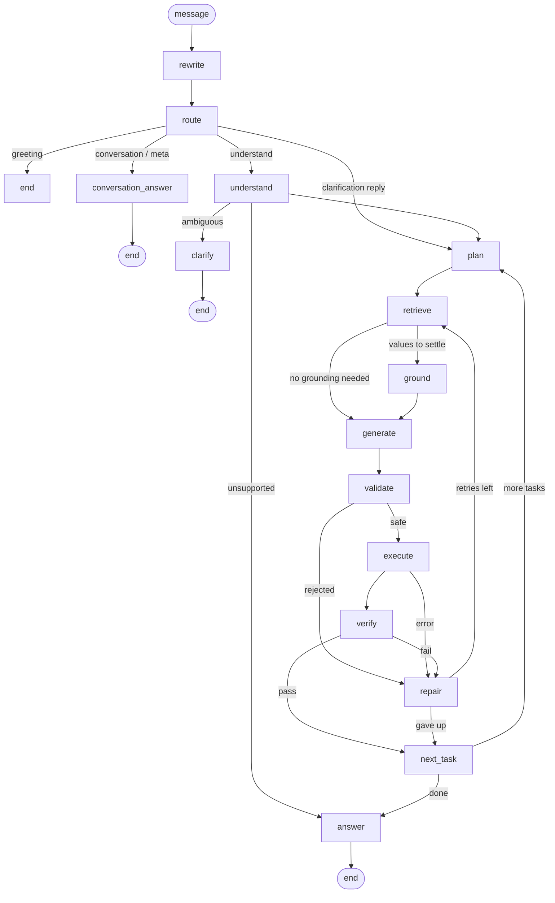
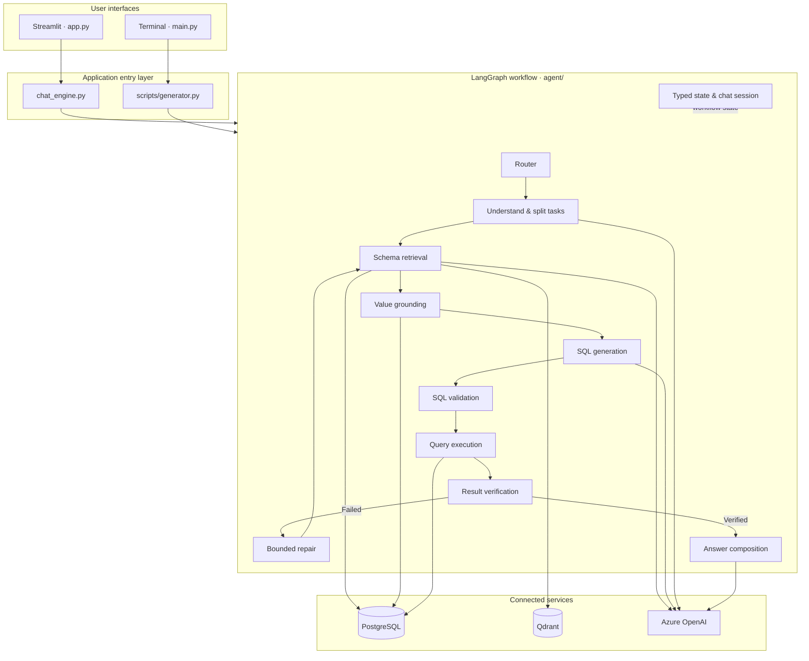

<div align="center">

# Chinook Database Chat


### Ask your PostgreSQL database questions in plain English.

A database-aware assistant powered by **LangGraph**, **Azure OpenAI**, **Qdrant**, and **PostgreSQL**. It routes each message, retrieves live schema context, grounds values against real data, generates read-only SQL, validates and executes it, verifies the result, and explains the answer.

<br/>


</div>

---

## Contents

- [At a glance](#at-a-glance)
- [Why this project](#why-this-project)
- [How it works](#how-it-works)
- [Architecture](#architecture)
- [Core capabilities](#core-capabilities)
- [Technology stack](#technology-stack)
- [Getting started](#getting-started)
- [Configuration](#configuration)
- [Project structure](#project-structure)
- [Safety and reliability](#safety-and-reliability)
- [Limitations and implementation notes](#limitations-and-implementation-notes)

---

## At a glance

Chinook Database Chat turns natural-language questions into database-backed answers. Instead of sending every message directly to a text-to-SQL prompt, it uses a routed, multi-stage workflow designed to make incorrect results easier to detect and contain.

**The schema is discovered at runtime.** Table names, columns, types, and table-level evidence are read from the connected database. The application is not tied to the Chinook table names, although the repository includes Chinook seed-data references.

| Interface | Entry point |
|---|---|
| Streamlit web app | `app.py` |
| Terminal chat | `main.py` |
| Shared workflow API | `chat_engine.py` / `scripts/generator.py` |

---

## Why this project

| Challenge | How the workflow handles it |
|---|---|
| Greetings trigger unnecessary database work | A message router can answer non-database routes without touching the database. |
| Multi-part questions lose sub-questions | The understanding stage splits a request into independent tasks. |
| Valid SQL can still answer the wrong question | Result verification checks row shape, limits, and entity agreement. |
| User-provided values may not match stored values | Grounding probes actual database values before adopting a mapping. |
| Ambiguous requests are guessed or abandoned | Clarifications are attached to the relevant request or task and can resume it. |
| One SQL error breaks later queries | Execution rolls back on failure, and connection handling can reconnect when needed. |
| The workflow is difficult to inspect | Results include task traces, workflow events, timings, and token usage. |

---

## How it works



### The task lifecycle

Each database task moves through a bounded sequence:

1. **Understand** the user's intent, entities, filters, metrics, and expected result shape.
2. **Retrieve** schema context from the chat cache or Qdrant.
3. **Ground** user-provided values against the live database.
4. **Generate** SQL through the `run_sql_query` tool call.
5. **Validate** that the query is a single, allowed `SELECT` and references real tables.
6. **Execute** with a statement timeout and a bounded result fetch.
7. **Verify** the result using deterministic checks, with a limited semantic check when needed.
8. **Repair** failed tasks within the configured attempt limit.
9. **Answer** using verified results, while keeping failed tasks from contributing stale rows.

---

## Architecture

### System overview



### Main layers

| Layer | Responsibility |
|---|---|
| **Presentation** | Streamlit and CLI; owns UI/session state and displays progress and results. |
| **Application seam** | Shared entry points that call the workflow and normalize results. |
| **Orchestration** | LangGraph nodes, transitions, timing, retry bounds, and result shaping. |
| **Decision logic** | Routing, request understanding, grounding, and task planning. |
| **Validation & verification** | SQL safety checks and result-level consistency checks. |
| **Data access** | PostgreSQL connections, introspection, fingerprints, indexing, retrieval, and SQL execution. |
| **Model access** | Centralized Azure OpenAI calls, JSON parsing, and token accounting. |

### Routes

The router classifies each message into one of six routes:

- `greeting` — greetings, thanks, apologies, and goodbyes.
- `conversation` — questions about the current conversation.
- `meta` — questions about the assistant and its capabilities.
- `clarification` — a reply to an outstanding clarification.
- `followup` — a continuation or modification of a previous database question.
- `database` — questions that require data from the database.

The graph is compiled once per process. Conversation state is held by `ChatSession`; the workflow does not use a LangGraph checkpointer.

---

## Core capabilities

<details>
<summary><strong>Dynamic schema discovery and retrieval</strong></summary>

- Every table is searched for, never assumed small enough to send whole: dense (embedding) and lexical (word overlap) search over the indexed tables are fused by reciprocal rank, the same way regardless of how many tables the database has.
- Foreign keys are read from the catalog once, at index time, and the tables on the join path between whichever tables were actually retrieved are added automatically, so a question that never names a join table still gets one it needs.
- A second index of real, low-cardinality column values (a country, a genre, a status) lets a question's own words ("Americans", "rock") be matched to what a column actually stores, by meaning rather than by exact substring.
- Caches retrieved schema per chat session.
- Enriches indexed table definitions with short evidence generated from sampled rows, with anything that looks like a person's contact details masked out first.

</details>

<details>
<summary><strong>Value grounding</strong></summary>

- Probes textual columns using `ILIKE` against actual stored values.
- If the hinted column does not match, ranks and probes other candidate text columns.
- When needed, asks the grounding model to choose from a bounded list of values sampled from the database.
- Uses a mapping only when it is confirmed against real stored values.
- Can ask the user for clarification instead of silently filtering on an unverified value.

</details>

<details>
<summary><strong>SQL validation and execution</strong></summary>

The validation path checks that:

1. SQL parses as exactly one PostgreSQL statement.
2. The statement is a `SELECT`.
3. Forbidden operations are rejected after string literals are stripped.
4. Referenced tables exist in the live catalog.

Execution re-validates the query, applies a `statement_timeout` of **3,000 ms**, and fetches at most **500 rows**, flagging the result as truncated rather than reporting a partial count as the total. Postgres connections are pooled, so one question's transaction can never block another's.

</details>

<details>
<summary><strong>Result verification and repair</strong></summary>

Deterministic checks cover execution status, requested row limits, aggregate shape, single-row shape, entity agreement, and empty results. A limited semantic verification call is used only when deterministic checks remain inconclusive.

Failed tasks can be retried up to `DEFAULT_MAX_ATTEMPTS`. When attempts are exhausted, the task's result rows are cleared so stale data cannot be used in the final answer.

</details>

<details>
<summary><strong>Clarification and multi-task handling</strong></summary>

- Splits compound requests into separate `TaskState` objects.
- Associates clarification questions with the request or specific task they concern.
- Resumes the relevant work after the user responds.
- Keeps already completed tasks when only one task needs clarification.
- Stores compact turn summaries rather than the full transcript.

</details>

<details>
<summary><strong>Tracing and token accounting</strong></summary>

Each turn can include the route, task-level trace, workflow events, stage timings, SQL, result rows, model name, and provider-reported token usage. Usage tracks input, output, total tokens, and LLM call count.

</details>

---

## Technology stack

| Component | Role |
|---|---|
| Python 3.12 | Runtime |
| LangGraph | Workflow orchestration |
| PostgreSQL + `psycopg2` | Relational database |
| Qdrant | Vector storage and schema retrieval |
| Azure OpenAI `text-embedding-3-small` | Embeddings |
| Azure OpenAI | Understanding, SQL generation, grounding, and answer composition |
| SQLGlot | SQL parsing and validation support |
| Streamlit | Web interface |
| pandas | Tabular result handling |
| uv | Dependency and environment management |

---

## Getting started

### Prerequisites

- Python **3.12**
- A reachable PostgreSQL database
- A reachable Qdrant instance
- An Azure OpenAI resource with both chat deployments and an embedding deployment configured
- [uv](https://docs.astral.sh/uv/) installed

### 1. Get the project and configure the environment

```bash
git clone https://github.com/mahmoudalrefaey/chinhook.git
cd chinhook

cp .env.example .env
```

Fill in the required values in `.env` before starting the application.

### 2. Install dependencies

```bash
uv sync
```

### 3. Prepare the database

If you are using the included Chinook seed data, `data/deploy.py` is the loader referenced by the project. **Review and configure its database connection before running it.** The script is a one-off CSV-to-PostgreSQL loader.

### 4. Start the application

**Web interface**

```bash
uv run --with streamlit streamlit run app.py
```

**Terminal interface**

```bash
uv run python main.py
```

### 5. Manage the schema index

```bash
# Inspect index status
uv run python scripts/indexer.py --status

# Check whether indexing is needed
uv run python scripts/indexer.py --check

# Rebuild the index
uv run python scripts/indexer.py --full
```

### 6. Run with Docker

```bash
docker compose up
```

Brings up Qdrant, a one-shot job that indexes the database, and the web interface itself,
each in its own container; embeddings come from the Azure deployment named in `.env`, not a
local model. `DATABASE_URL` in `.env`
still points at wherever Postgres already lives. To also run a local Postgres, with the
Chinook schema and the read-only role already set up, layer the local-db file on top instead:

```bash
docker compose -f docker-compose.yml -f docker-compose.local-db.yml up
```

---

## Configuration

The application loads environment values through `config.py`.

| Variable | Purpose |
|---|---|
| `AZURE_OPENAI_KEY` | Shared Azure OpenAI API key |
| `AZURE_OPENAI_ENDPOINT1` | Endpoint for deployment 1 |
| `DEPLOYMENT1_NAME` | Deployment name for deployment 1 |
| `AZURE_OPENAI_ENDPOINT2` | Endpoint for deployment 2 |
| `DEPLOYMENT2_NAME` | Deployment name for deployment 2 |
| `DATABASE_URL` | PostgreSQL connection string |
| `QDRANT_URL` | Qdrant URL; defaults to `http://localhost:6333` |
| `QDRANT_COLLECTION_TABLES` | Table index collection name; defaults to `schema_tables` |
| `QDRANT_COLLECTION_VALUES` | Value index collection name; defaults to `schema_values` |
| `AZURE_EMBEDDING_KEY` | API key for the embedding deployment |
| `AZURE_EMBEDDING_ENDPOINT` | Endpoint for the embedding deployment |
| `EMBED_MODEL` | Embedding deployment name; defaults to `text-embedding-3-small` |
| `EMBED_DIM` | Vector size the embedding deployment produces; defaults to `1536` |
| `AUTO_INDEX_ON_STARTUP` | Whether the terminal CLI checks the index at startup; defaults to `true` |

Additional implementation details:

- The configured model identifiers are hardcoded in `config.py` as `gpt-4.1-nano` and `gpt-4.1-mini`.
- `MODEL1_NAME` and `MODEL2_NAME` appear in `.env.example` but are not read anywhere that affects behaviour.
- PostgreSQL's SSL mode comes from `DATABASE_URL` itself, so a local or CI database without TLS connects normally.

---

## Project structure

```text
chinhook/
├── app.py                     # Streamlit web interface
├── main.py                    # Terminal interface
├── chat_engine.py             # Shared workflow entry point
├── config.py                  # Environment and model configuration
├── pyproject.toml             # Project metadata and dependencies
├── uv.lock                    # Locked dependencies
├── Dockerfile
├── start.sh
├── .env.example
├── agent/
│   ├── graph.py               # LangGraph assembly and execution
│   ├── router.py              # Message classification
│   ├── state.py               # Typed workflow and session state
│   ├── schema.py              # Live catalog and schema cache
│   ├── verify.py              # Deterministic result checks
│   ├── llm.py                 # Model calls and token accounting
│   ├── session.py             # Chat-session creation
│   └── nodes/
│       ├── route.py
│       ├── routing.py
│       ├── greeting.py
│       ├── understand.py
│       ├── clarify.py
│       ├── plan.py
│       ├── retrieve.py
│       ├── ground.py
│       ├── generate.py
│       ├── validate.py
│       ├── execute.py
│       ├── verify.py
│       ├── repair.py
│       ├── answer.py
│       ├── common.py
│       └── prompts.py
├── scripts/
│   ├── generator.py            # Shared generator interface
│   ├── indexer.py              # Index maintenance CLI
│   ├── db_module.py            # Compatibility re-export
│   └── db/
│       ├── clients.py
│       ├── introspection.py
│       ├── fingerprinting.py
│       ├── evidence.py
│       ├── indexing.py
│       ├── retrieval.py
│       └── sql.py
├── ui/
│   └── render.py               # Markdown/HTML rendering helpers
├── assets/
│   ├── styles.css
│   ├── banner.png
│   └── icon.svg
└── data/                       # Local seed data; gitignored
    ├── *.csv
    ├── Schema.jpg
    └── deploy.py
```

### Useful module map

| Module | What it owns |
|---|---|
| `agent/graph.py` | Node registration, edges, conditional routing, timing, recursion limit, and result shaping |
| `agent/router.py` | Route classification and clarification-reply resolution |
| `agent/nodes/understand.py` | Request parsing, task decomposition, and ambiguity handling |
| `agent/nodes/ground.py` | Live value probing and mapping |
| `agent/nodes/validate.py` | SQL safety gates |
| `agent/nodes/execute.py` | Query execution and task result capture |
| `agent/verify.py` | Deterministic verification rules |
| `agent/nodes/repair.py` | Bounded retry and task advancement |
| `agent/nodes/answer.py` | Final response composition and completeness guard |
| `scripts/db/indexing.py` | Full and incremental schema indexing |
| `scripts/db/fingerprinting.py` | Schema/data fingerprint comparison |
| `scripts/db/retrieval.py` | Schema retrieval from the vector store |
| `scripts/db/sql.py` | SQL validation and read-only query execution |
| `ui/render.py` | Markdown rendering, tables, and pipeline visualization |

---

## Safety and reliability

- **Read-only query path:** the SQL tool is intended for `SELECT` statements only.
- **Single-statement validation:** multiple SQL statements are rejected.
- **Live catalog checks:** referenced tables are checked against the connected database.
- **Bounded execution:** queries use a statement timeout and a maximum fetched-row count.
- **Bounded repair:** retries are controlled by an attempt limit.
- **Verified-only answer composition:** failed tasks do not contribute stale rows or figures.
- **Error recovery:** SQL failures trigger rollback; a dead connection can be re-established.
- **Traceability:** task-level state, workflow events, timing, and token usage are returned for inspection.

> **Credential caution:** The source notes that `data/deploy.py` contains a hardcoded PostgreSQL connection string with a password. Treat that credential as exposed if it was ever shared or committed, and rotate it. Do not commit secrets to the repository.

---

## Limitations and implementation notes

- **No automated test suite was found** in the documented working tree, although `pytest` is listed as a development dependency.
- **No runtime verification was performed** for this documentation pass. The workflow description is based on code inspection; no LLM calls or database queries were run.
- **No LangGraph checkpointer or durable conversation store** is configured. Chat state is held in the caller's session.
- **No authentication or rate limiting** is implemented in the described application. Streamlit session state provides the chat-session boundary.
- **No write operations** are exposed through the SQL tool.
- `chat_engine.compare()` runs model comparisons sequentially.
- `validate_config()` has a known mismatch: it checks the mini deployment but reports the nano deployment's environment-variable names when configuration is missing.
- The `.env` file is local configuration and should not be committed. Supply the required API key, database URL, and deployment settings securely.

---

<div align="center">

**Built around a simple idea:** a database answer should be grounded in the data, checked before it is reported, and understandable to the person who asked.

</div>
