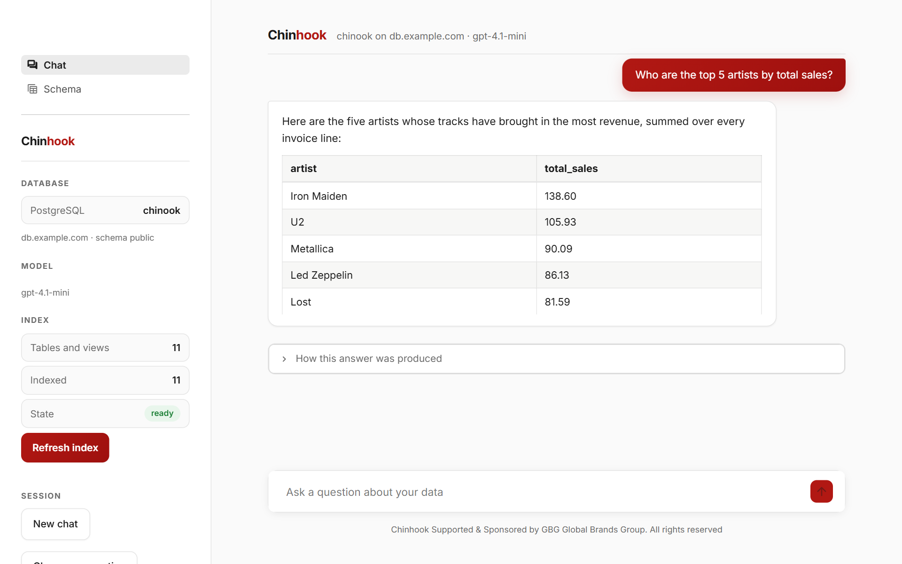
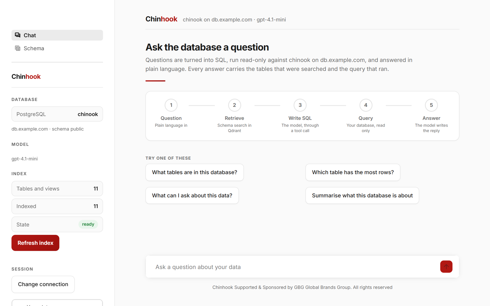
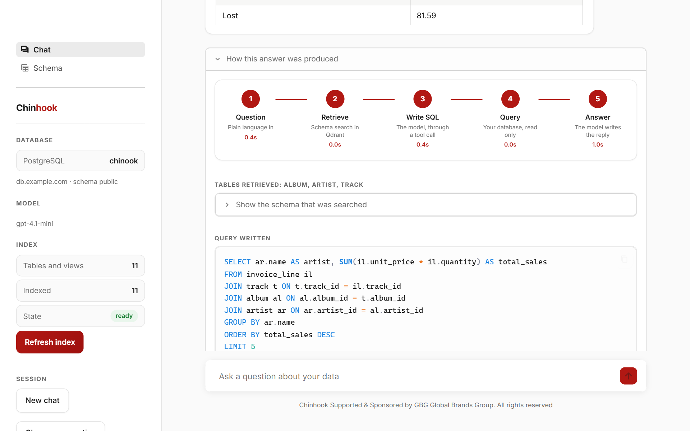
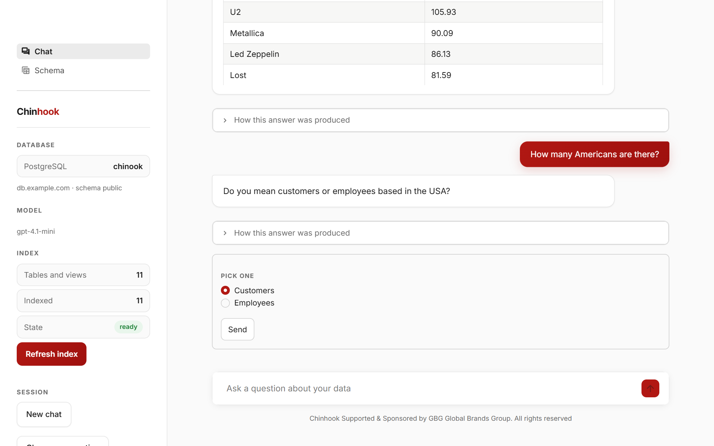
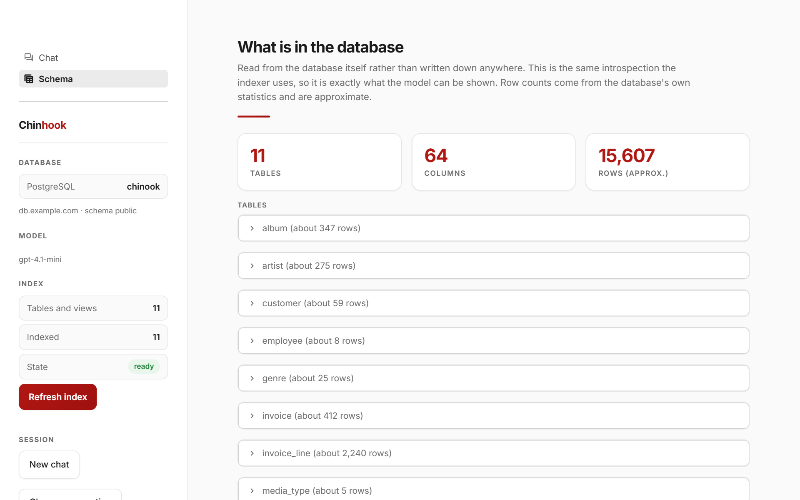
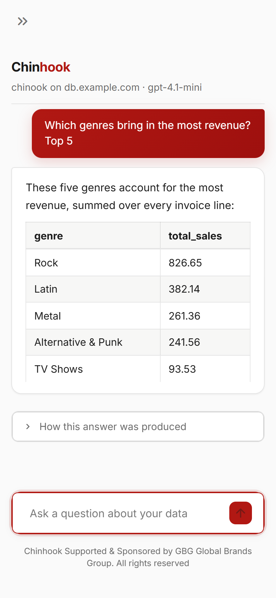
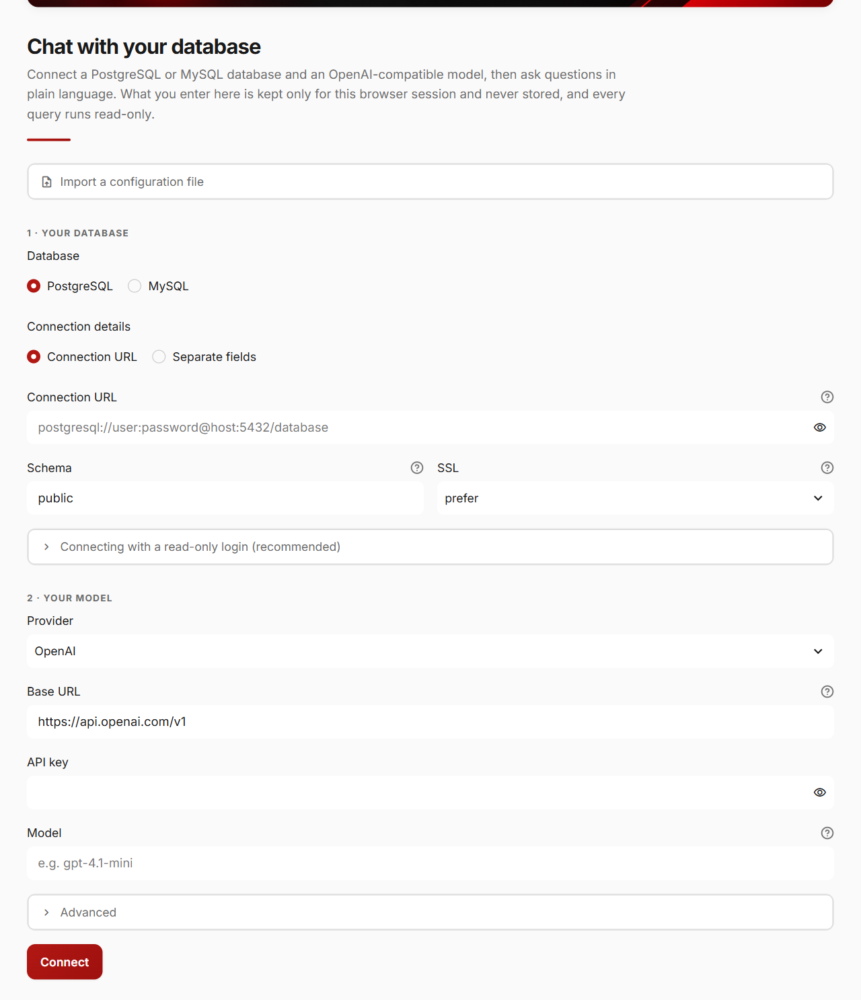
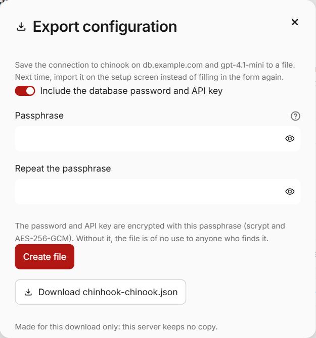
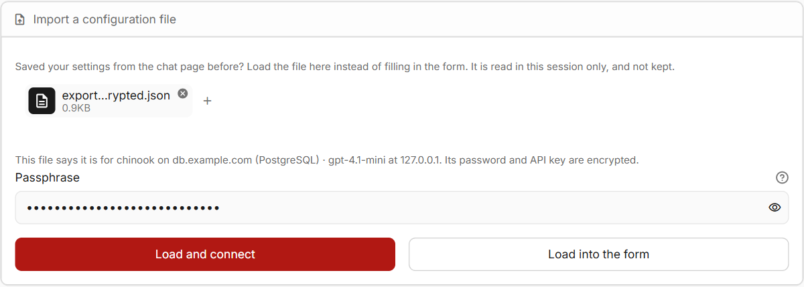
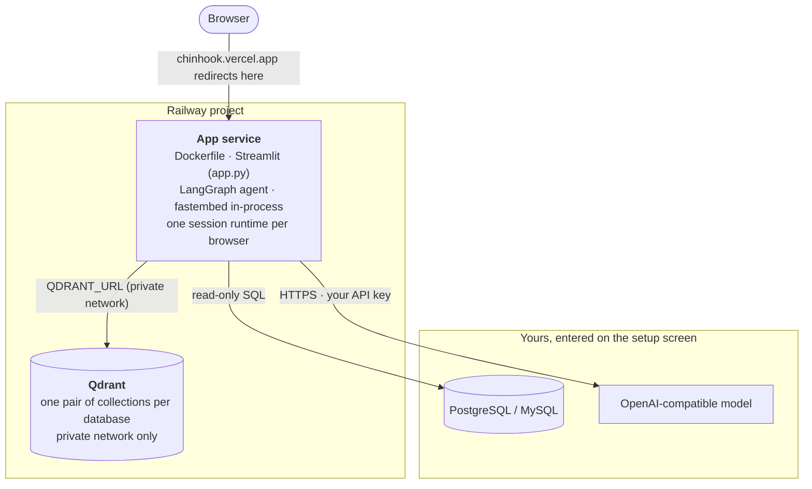

<div align="center">


<h3>Ask your PostgreSQL or MySQL database questions in plain language.</h3>

<p>
Bring your own database and any OpenAI-compatible model. Chinhook finds the tables a question needs,<br>
writes read-only SQL, checks it, runs it, verifies the result, and streams back an answer<br>
that shows exactly how it was produced.
</p>

<p>
<a href="https://chinhook.vercel.app"><strong>Open the live app</strong></a>
&nbsp;·&nbsp;
<a href="#how-it-works">How it works</a>
&nbsp;·&nbsp;
<a href="#troubleshooting">Troubleshooting</a>
&nbsp;·&nbsp;
<a href="SECURITY.md">Security</a>
</p>

<a href="https://chinhook.vercel.app"></a>


<br>


<a href="LICENSE"></a>

</div>

<br>

<p align="center">
  
</p>

---

## Contents

- [Highlights](#highlights)
- [A closer look](#a-closer-look)
- [Using the app](#using-the-app)
- [What happens to your data](#what-happens-to-your-data)
- [How it works](#how-it-works)
- [Supported databases and models](#supported-databases-and-models)
- [Project structure](#project-structure)
- [Security and reliability](#security-and-reliability)
- [Troubleshooting](#troubleshooting)
- [Limitations](#limitations)
- [Contributing](#contributing)
- [Team](#team)
- [License and credits](#license-and-credits)

---

## Highlights

<table>
<tr>
<td width="50%" valign="top">

### Bring your own database and model
Connect PostgreSQL or MySQL and any OpenAI-compatible endpoint on the setup screen. Nothing is configured in code, and nothing you enter is stored on the server. Export your setup to an encrypted file, and next time connect in one step.

</td>
<td width="50%" valign="top">

### Read-only, enforced by the database
Every connection the app opens is a read-only session, so a write fails at the database itself, even with a login that could write.

</td>
</tr>
<tr>
<td valign="top">

### Built for real schemas
The schema is searched, not pasted into a prompt: hybrid dense and lexical search over an index of your tables, expanded along foreign keys, plus an index of real values that turns "Americans" into `country = 'USA'`.

</td>
<td valign="top">

### Every answer shows its work
Each answer comes with the tables that were searched, the SQL that ran, the rows it returned, the time each step took and the tokens it cost.

</td>
</tr>
<tr>
<td valign="top">

### Asks instead of guessing
If a question could mean two things ("How many Americans?": customers or employees?), Chinhook asks once and offers the options to pick from.

</td>
<td valign="top">

### Compound questions, in parallel
A message holding several questions becomes several tasks. Each gets its own SQL, checks and retries, and they all run at the same time.

</td>
</tr>
<tr>
<td valign="top">

### Verified before it is reported
Results are checked against what was asked: a "top 5" returns at most five rows, and a count returns one number. A failed check is repaired with the reason fed back.

</td>
<td valign="top">

### Keeps only what it needs
Credentials live in your browser session only. The index of your schema expires after 7 days without use, or is deleted the moment you ask.

</td>
</tr>
</table>

---

## A closer look

<table>
<tr>
<td width="50%" valign="top">

<p align="center"><b>Start</b>: the pipeline every question goes through, and questions to try</p>
</td>
<td width="50%" valign="top">

<p align="center"><b>See how</b>: time per step, tables retrieved, the exact SQL</p>
</td>
</tr>
<tr>
<td valign="top">

<p align="center"><b>Clarify</b>: an ambiguous question is asked back once</p>
</td>
<td valign="top">

<p align="center"><b>Explore</b>: every table and view, read live from the database</p>
</td>
</tr>
</table>

<table>
<tr>
<td width="62%" valign="middle">

### Works on a phone, and survives a dropped connection

- The chat input stays pinned to the bottom of the screen, and each new answer scrolls into view as it streams in.
- Chat and Schema are separate pages in the sidebar, so switching between them keeps your conversation.
- If the connection drops (Wi-Fi blips, a laptop sleeps), you have **five minutes** to come back to the same session, with your connection settings and chat intact.

</td>
<td width="38%" align="center">

</td>
</tr>
</table>

---

## Using the app



1. **Open the app** at [chinhook.vercel.app](https://chinhook.vercel.app).
2. **Connect your database.** Pick PostgreSQL or MySQL, then paste the connection URL your provider gives you, or fill in the separate fields.
   - For PostgreSQL, choose the schema to answer from (`public` by default).
   - **SSL**: `prefer` encrypts when the server supports it, `require` always encrypts, and `disable` never does. An `sslmode` written in the URL itself takes precedence.
   - The database must be **reachable from the internet**, because the app connects to it from its server.
   - A login that can only read is recommended. The setup screen shows the SQL to create one.
3. **Choose your model.** Pick a provider preset, or **Other** for any OpenAI-compatible base URL, then enter your API key and a model name. The model must support **tool (function) calling**. Under *Advanced*, an optional cheaper *fast model* writes the table descriptions during indexing.
4. **Connect.** The app logs in to your database for real, checks that it can see your tables, and checks that the model answers and calls tools. If anything fails, it tells you what to change.
5. **Wait for indexing, once.** The first time a database is connected, each table is read, your model describes it in one sentence, and the description is indexed. Reconnecting later reuses the index. **Refresh index** re-indexes only the tables that changed.
6. **Ask.** Under every answer, **How this answer was produced** shows the pipeline, the tables, the SQL, the rows and the tasks the question became.

The sidebar shows what is connected and the state of the index. It also holds **New chat**, **Export configuration**, **Change connection** and, under *Your data*, **Delete this database's index**, which removes everything the server holds about your database.

<br clear="right">

### Save your setup for next time

Instead of filling in the form on every visit, save the connection to a file once and load it on the next one.



- **Export.** Once connected, press **Export configuration** in the sidebar. Choose a passphrase of at least 10 characters to include the database password and API key, or turn that switch off to leave them out. Press **Create file**, then download `chinhook-<database>.json`.
- **Import.** On the setup screen, open **Import a configuration file** and choose the file. Enter its passphrase (or, for a file without them, the database password and API key), then press **Load and connect**. **Load into the form** fills in the form instead, so you can check or change something before connecting.
- **What is in the file.** The database URL, schema and SSL setting, and the provider, base URL, model and fast model. With a passphrase, all of it, password and key included, is encrypted with AES-256-GCM under a key derived from the passphrase with scrypt. A wrong passphrase, or a file changed after it was exported, does not load. Without a passphrase, the password and key are not in the file at all.
- **Nothing is kept.** The file is made in memory for your download and read in memory when you import it. The server keeps no copy, and the passphrase fields are emptied as soon as they have been used.

<br clear="right">

<p align="center">
  
  <br><sub><b>Import</b> on the setup screen: choose the file, enter its passphrase, and connect.</sub>
</p>

> [!WARNING]
> A passphrase can't be recovered. If you forget it, connect through the form again and export a new file.

> [!TIP]
> No database handy? Load the [Chinook sample database](https://github.com/lerocha/chinook-database) (a music store with artists, albums, tracks, customers and invoices) into a free hosted PostgreSQL or MySQL, then connect to it. The screenshots in this README use it.

---

## What happens to your data

| What | Where it goes | How long |
|---|---|---|
| Your database URL, login and password, and your model API key | The server's memory, for your browser session only | Until you close the tab or change the connection. A dropped connection is held for five minutes so it can resume. Never written to disk, a database or the page URL |
| Your database | Read by read-only queries only. Nothing is ever written to it | n/a |
| The index: table and column names, a one-line description of each table, and common values of category-like columns (countries, statuses, genres) | The deployment's Qdrant | Deleted after 7 days without use, or immediately with **Delete this database's index** |
| Your questions, the relevant part of your schema and the rows a query returns, plus a few sample rows per table at index time | Your model provider, through the API key you gave | As long as that provider keeps them |
| A configuration file you export | Your own computer, downloaded straight from your session. The server keeps no copy | Until you delete it. The password and API key are in it only encrypted under your passphrase, or not at all |

Columns that look like contact details (email, phone, address, names) are masked as `[redacted]` in the sample rows sent to the model, and they are never indexed as values.

---

## How it works


An ordinary question costs **three model calls**: understanding the question, writing SQL (once per task) and writing the answer (streamed).

1. **Route.** Small talk and replies to an open clarifying question are recognised without a model call.
2. **Understand.** One call reads the message against the conversation and the slice of the schema retrieved for it. It splits a compound question into independent tasks and decides whether something has to be asked first.
3. **Retrieve.** Each task runs a hybrid search over the index: dense embeddings combined with word overlap with table and column names. The results are expanded with the tables on the foreign-key path between the ones that matched. A second index of real values maps the user's words to what is actually stored.
4. **Generate.** The model writes one `SELECT` through a tool call, given only the retrieved slice of the schema.
5. **Check and run.** The query is parsed with [`sqlglot`](https://github.com/tobymao/sqlglot) in your database's dialect. It must be one statement, a `SELECT` only, using real tables only, with nothing from the forbidden list. It runs in a read-only transaction with a 10-second limit and a 500-row cap.
6. **Verify.** Deterministic checks: did it run, does the result have the shape that was asked for, does it read the table the question was about. A failure is repaired with its reason fed back, up to a bounded number of attempts.
7. **Answer.** The answer is written only from verified results and streamed as it is written. A multi-row result's table is built from the verified rows themselves, not retyped by the model.

### Architecture



- **One runtime per browser session.** It holds that session's database and model settings, in memory only, and every call made on the session's behalf uses it.
- **One connection pool per database.** Every connection in it is switched to read-only before anything else runs on it.
- **One pair of Qdrant collections per database.** They are named `chinhook_<16 hex>_tables` and `_values` from a hash of the database, schema, user and embedding model. No session can read another database's index, and reconnecting to the same database reuses its index.
- **Embeddings run inside the app** with [fastembed](https://github.com/qdrant/fastembed) (`BAAI/bge-small-en-v1.5` by default, baked into the image at build time), so visitors only need to bring a chat model.

---

## Supported databases and models

### Databases

**PostgreSQL** and **MySQL**, including their hosted forms: Supabase, Neon, Prisma Postgres, Amazon RDS and Aurora, Google Cloud SQL, Azure Database, Railway, Render, PlanetScale and others. Tested on PostgreSQL 18 and MySQL 8.4. MariaDB should work, but it is less tested.

- **Views**, **mixed-case names** and **non-`public` PostgreSQL schemas** are supported.
- MySQL logins that use `caching_sha2_password` (the MySQL 8 default) work out of the box.
- The database must accept connections from the internet. `localhost` and private networks are refused on a public deployment (see [Security](#security-and-reliability)).

### Models

Any endpoint that speaks the OpenAI Chat Completions API and supports **tool calling**:

| Provider | Base URL | Model |
|---|---|---|
| OpenAI | `https://api.openai.com/v1` | e.g. `gpt-4.1-mini` |
| Azure OpenAI | `https://<resource>.openai.azure.com/openai/v1` | **your deployment name** |
| OpenRouter | `https://openrouter.ai/api/v1` | e.g. `openai/gpt-4.1-mini` |
| Groq | `https://api.groq.com/openai/v1` | a tool-calling model |
| Google Gemini | `https://generativelanguage.googleapis.com/v1beta/openai` | e.g. `gemini-2.5-flash` |
| Anthropic | `https://api.anthropic.com/v1` | e.g. a Claude Sonnet model |
| Mistral | `https://api.mistral.ai/v1` | e.g. `mistral-large-latest` |
| Other | any OpenAI-compatible `/v1` URL (Together, Fireworks, DeepSeek, a self-hosted vLLM, …) | as that server names it |

> [!NOTE]
> **Azure OpenAI:** enter the **v1 base URL** above, not a full `…/openai/deployments/<name>/chat/completions?api-version=…` address, and use your **deployment name** as the model. The key must come from the same Azure resource.

Endpoint quirks are handled automatically. These include reasoning models that refuse `temperature`, servers that only accept `max_tokens`, and servers that reject `stream_options`.

---

## Project structure

```text
.
├── app.py                    # The Streamlit page: setup, indexing, and the Chat and Schema pages
├── chinhook/                 # Everything app.py calls
│   ├── chat_engine.py        #   The one entry point the page uses: answer, index, schema
│   ├── connection.py         #   Setup: reading what was typed, the public-host guard, checks
│   ├── settings_file.py      #   Exporting and importing a connection, encrypted
│   ├── runtime.py            #   The database and model one browser session is connected to
│   ├── config.py             #   The deployment's own settings, from environment variables
│   ├── rate_limit.py         #   Per-session and global limits
│   ├── agent/                #   The LangGraph workflow
│   │   ├── graph.py          #     Parent graph: routing, parallel tasks, timing
│   │   ├── task_graph.py     #     One task: retrieve, write SQL, check and run, verify, repair
│   │   ├── llm.py            #     OpenAI-compatible model calls, streaming, token accounting
│   │   ├── router.py         #     Routing that needs no model call
│   │   ├── schema.py         #     Per-database catalog cache and schema retrieval
│   │   ├── verify.py         #     Deterministic result checks
│   │   ├── state.py          #     Typed workflow and session state
│   │   └── nodes/            #     route, understand, clarify, greeting, answer, prompts
│   ├── db/                   #   Database access and the vector index
│   │   ├── clients.py        #     Per-database connection pools, Qdrant, embeddings
│   │   ├── dialects.py       #     What differs between PostgreSQL and MySQL
│   │   ├── introspection.py  #     Tables, views, columns, foreign keys, row estimates
│   │   ├── indexing.py       #     Building and updating the index
│   │   ├── fingerprinting.py #     Whether the index still matches the database
│   │   ├── retrieval.py      #     Hybrid table search and value search
│   │   ├── evidence.py       #     The one-line description of each table
│   │   ├── values.py         #     Which column values are worth indexing
│   │   ├── pii.py            #     Columns treated as contact details
│   │   ├── retention.py      #     Expiring indexes nobody uses
│   │   └── sql.py            #     SQL validation and read-only execution
│   └── ui/
│       ├── render.py         #     Markdown rendering and sanitising, the pipeline diagram
│       └── styles.css        #     The page's styles
├── static/                   # Served at app/static/: the banner and icon (screenshots are for this README only)
├── .streamlit/config.toml    # Theme, static file serving, how long a dropped session is kept
├── deploy/vercel/            # The fallback page for the Vercel redirect
├── vercel.json               # Makes a Vercel project a redirect to the app
├── Dockerfile                # The image Railway, or any Docker host, runs
├── pyproject.toml, uv.lock   # Dependencies, locked
├── LICENSE, NOTICE           # Apache 2.0, plus the credit and naming terms every copy keeps
└── SECURITY.md               # How to report a vulnerability
```

---

## Security and reliability

- **Read-only at the database.**
  - PostgreSQL sessions run every transaction as `READ ONLY`.
  - MySQL sessions are set to `SET SESSION TRANSACTION READ ONLY`, and each borrowed connection starts with `START TRANSACTION READ ONLY`.
  - A write fails at the database even with a superuser login, even if every check above it were fooled.
- **SQL validation.**
  - One statement only: a `SELECT`, or a `UNION`/`INTERSECT`/`EXCEPT` of them.
  - The whole syntax tree is walked for writes hidden in CTEs, as well as `INTO`, `SET`, `COPY` and `GRANT`.
  - Each dialect has its own forbidden functions:
    - PostgreSQL: `pg_sleep`, `pg_read_file`, `dblink` and more.
    - MySQL: `SLEEP`, `BENCHMARK`, `LOAD_FILE`, `GET_LOCK` and more.
- **Only your schema.** A query may read only the tables and views of the connected schema. The database's own catalog is also allowed, so questions about the database itself can be answered.
- **Bounded.**
  - Each query has a 10-second limit and returns at most 500 rows. A cut-off result is flagged, never presented as complete.
  - Repair attempts are bounded.
  - There are limits on the tables indexed and on concurrent indexing jobs.
  - Questions are rate-limited per session and globally, and setup attempts are rate-limited too.
- **Can't reach the server's own network.**
  - Database hosts and model URLs must resolve to public addresses.
  - `localhost`, private and link-local ranges, cloud metadata addresses, and names like `qdrant.railway.internal` are refused.
  - The check runs again whenever a new connection pool is opened, and the model client never follows redirects.
- **Isolation between visitors.** Connection settings, chat history and schema caches are per session. Connection pools, model clients (keyed by a hash of the API key) and Qdrant collections are per database or per key. None of them are shared between visitors.
- **Sanitised output.** Answers are Markdown rendered through an allowlist HTML sanitiser ([nh3](https://github.com/messense/nh3)), so neither a model's reply nor a value in your data can inject script into the page.
- **Configuration files.**
  - The database password and API key go into an exported file only encrypted: AES-256-GCM, with the key derived from your passphrase by scrypt.
  - scrypt's cost is fixed by the app rather than read from the file, and at most two run at once, so a crafted file can't make the server do more work.
  - Imports are limited to 1 MB and rate-limited per session. What a file holds goes through the same checks as the form, the public-host guard included.
- **Optional gate.** A deployment can put one shared passphrase in front of the whole app. It is compared in constant time.

Found a security problem? Please report it privately, as described in [SECURITY.md](SECURITY.md).

---

## Troubleshooting

<details>
<summary><b>"<i>host</i> is not a public address"</b></summary>

<br>

The app connects to your database and model from its own server, so both must be reachable from the internet. `localhost`, private IPs and internal names such as `*.railway.internal` are refused on purpose. Use the public host your provider gives you. On Railway, for example, that is the database's *public* TCP proxy address.

</details>

<details>
<summary><b>"Connected, but schema "public" has no tables or views this login can read"</b></summary>

<br>

The login worked, but there is nothing to answer from:

- The tables live in another schema. Enter that schema on the setup screen.
- The database is still empty. A freshly created hosted database, a Prisma Postgres instance before its first migration for example, has no tables until you create or migrate them.
- The login has no `SELECT` grant on the tables. The setup screen shows the SQL to grant it.

</details>

<details>
<summary><b>"The API key was rejected" (especially with Azure OpenAI)</b></summary>

<br>

- Check that the key belongs to the provider whose base URL you entered.
- For **Azure OpenAI**, use `https://<resource>.openai.azure.com/openai/v1` as the base URL and your **deployment name** as the model, with a key from that same resource. Don't paste a full `…/deployments/…/chat/completions?api-version=…` address.

</details>

<details>
<summary><b>"The model was not found at this base URL"</b></summary>

<br>

The model name doesn't exist at that endpoint. Use the provider's exact model ID (or, on Azure, the deployment name), and make sure the base URL is the provider's OpenAI-compatible root, usually ending in `/v1`.

</details>

<details>
<summary><b>"That passphrase does not open this file"</b></summary>

<br>

Either the passphrase is not the one the file was exported with (it is case-sensitive), or the file was changed after it was exported. A passphrase can't be recovered: connect through the form again, then export a new file from the sidebar.

</details>

<details>
<summary><b>"Too many attempts in a short time" or a question-rate message</b></summary>

<br>

You've reached a rate limit. Wait the number of seconds shown and try again.

</details>

---

## Limitations

- Retrieval is only as good as the index. A table with an unhelpful name and no distinguishing sample data is harder to find.
- Dependencies between the tasks of one message are limited: a filter can be shared from one task's question to another's, but tasks don't share actual query results.
- Row counts on the Schema page come from the database's statistics and are approximate.
- Sessions live in the memory of one app process, so a restart or redeploy asks everyone to connect again. Indexes are kept.
- Databases must be reachable from the internet. There is no SSH tunnel or private-network option for visitors' databases.
- The optional login is one shared passphrase, not per-user accounts.

---

## Contributing

Issues and pull requests are welcome, and contributions are accepted under the same Apache 2.0 license. This branch is the **deployment** branch: it holds exactly what runs in production and nothing for local tooling, so keep changes here deployable as they are. Please report security problems privately, as described in [SECURITY.md](SECURITY.md).

---

## Team

<table>
<tr>
<td align="center" width="25%"><b>Mahmoud Muhammad Refaey</b><br><a href="https://github.com/mahmoudalrefaey">@mahmoudalrefaey</a></td>
<td align="center" width="25%"><b>Mohamed Taha</b><br><a href="https://github.com/mohamedtaha77">@mohamedtaha77</a></td>
<td align="center" width="25%"><b>Mariam Adel</b><br><a href="https://github.com/Mariam-adel7">@Mariam-adel7</a></td>
<td align="center" width="25%"><b>Roaa Elmarakby</b><br><a href="https://github.com/roaawal">@roaawal</a></td>
</tr>
</table>

Supported & sponsored by **GBG Global Brands Group**.

---

## License and credits

Released under the [Apache License 2.0](LICENSE). © 2026 Mahmoud Muhammad Refaey and the Chinhook contributors.

You may use, modify and redistribute the code, including commercially. Any copy or derivative must keep the copyright and the [NOTICE](NOTICE) file, which credits the original. The license covers the code, not the names: **"Chinhook", its icon and banner, and the GBG Global Brands Group name and logo are not licensed**. A fork or a service built on this code must use its own name and branding and must not present itself as Chinhook or as endorsed by its team or sponsor. Saying "based on Chinhook" with a link back to this repository is welcome.

Chinhook is built on [Streamlit](https://streamlit.io), [LangGraph](https://github.com/langchain-ai/langgraph), [Qdrant](https://qdrant.tech), [fastembed](https://github.com/qdrant/fastembed), [sqlglot](https://github.com/tobymao/sqlglot) and [SQLAlchemy](https://www.sqlalchemy.org). The screenshots use the [Chinook sample database](https://github.com/lerocha/chinook-database).

<br>

<div align="center">

**Chinhook is supported & sponsored by GBG Global Brands Group.**

<sub>Built around a simple idea: a database answer should be grounded in the data, checked before it is reported, and understandable to the person who asked.</sub>

</div>
