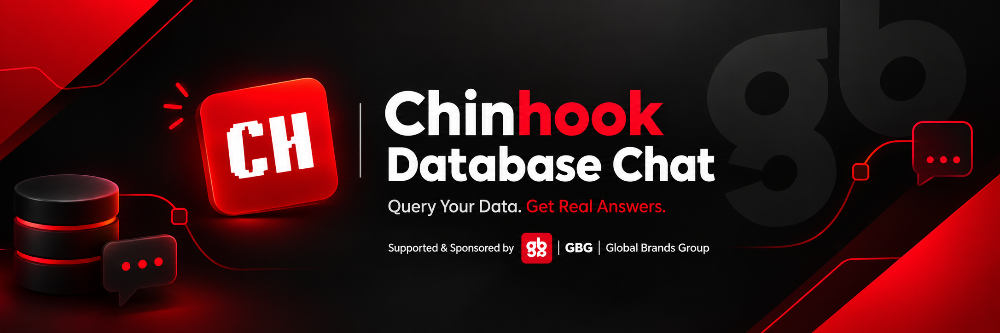
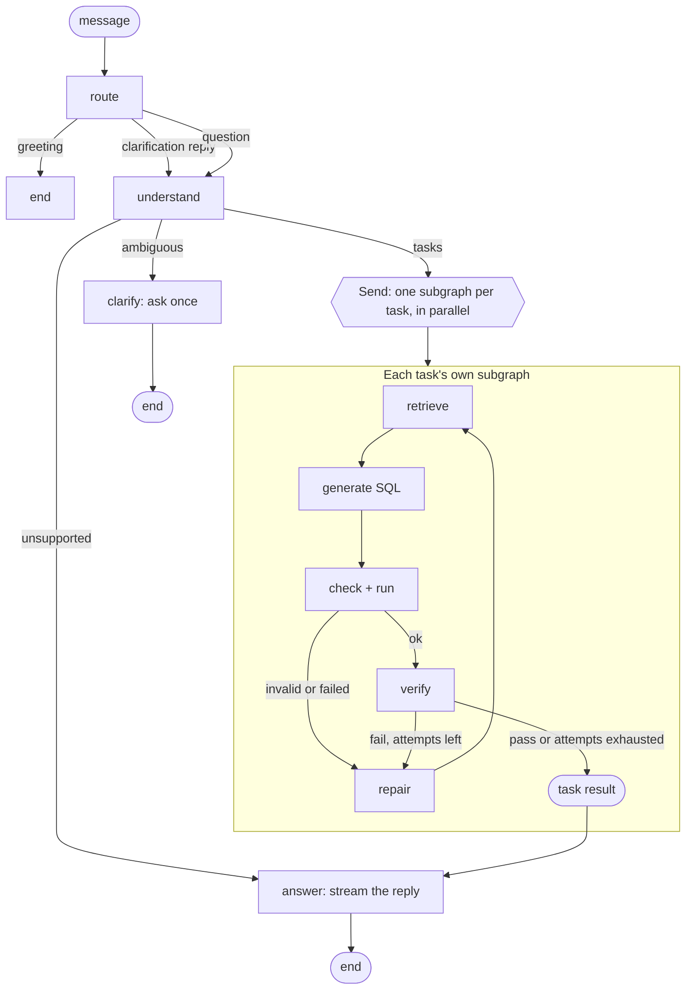
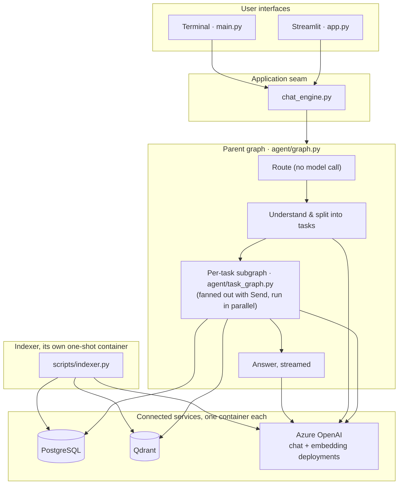

<div align="center">

# Chinook Database Chat



### Ask your PostgreSQL database questions in plain English.

A database-aware assistant powered by **LangGraph**, **Azure OpenAI**, **Qdrant**, and **PostgreSQL**. It routes each message, retrieves schema context from a vector index rather than the full catalog, generates read-only SQL for each task in parallel, validates and executes it, verifies the result, and streams the answer back as it is written.

<br/>


</div>

---

## Contents

- [At a glance](#at-a-glance)
- [Why this project](#why-this-project)
- [How it works](#how-it-works)
- [Architecture](#architecture)
- [Core capabilities](#core-capabilities)
- [Technology stack](#technology-stack)
- [Getting started](#getting-started)
- [Configuration](#configuration)
- [Project structure](#project-structure)
- [Safety and reliability](#safety-and-reliability)
- [Testing and CI](#testing-and-ci)
- [Limitations](#limitations)

---

## At a glance

Chinook Database Chat turns natural-language questions into database-backed answers. It is built as if the database were too large to describe in a single prompt: nothing about the design assumes the schema is small enough to send whole, even though the bundled Chinook dataset has only eleven tables.

**The schema is discovered at index time, not assumed.** Table definitions, foreign keys, and a sample of real column values are embedded into Qdrant by an indexer; the running app only ever reads that index, never the live catalog in bulk.

| Interface | Entry point |
|---|---|
| Streamlit web app | `app.py` |
| Terminal chat | `main.py` |
| Shared workflow API | `chat_engine.py` |

---

## Why this project

| Challenge | How the workflow handles it |
|---|---|
| A schema too big to paste into a prompt | Hybrid dense-and-lexical retrieval over an indexed vector store, the same way whether the database has eleven tables or eleven thousand. |
| Multi-part questions lose sub-questions | The understanding stage splits a request into independent tasks, each with its own filters carried over from the parts it depends on. |
| Ambiguous requests are guessed or asked about piecemeal | One request-level clarification, asked once with concrete options, not a question per task. |
| Valid SQL can still answer the wrong question | Deterministic result verification checks row shape, requested limits, and whether the query actually reads the entity the question named. |
| A value in the question may not match how it is stored | A second vector index of real, low-cardinality column values matches "Americans" to `country = 'USA'` from the data itself, not a guess. |
| Independent tasks used to run one after another | Each task is its own compiled LangGraph subgraph, fanned out with `Send` and run in parallel. |
| Answers arrived all at once after a long wait | Tokens stream from the model into the page and the terminal as they are written. |
| The workflow is difficult to inspect | Every answer carries the tables retrieved, the SQL run, per-stage timings, and token usage. |

---

## How it works



Model calls for an ordinary question: **understand once, generate once per task, answer once** — three calls total for a single-task question, streamed on the last one. Down from six to eight sequential calls in the graph this replaced.

### The task lifecycle

Each task runs as its own compiled subgraph, invoked from one parent node so independent tasks execute at the same time rather than one after another:

1. **Retrieve** — hybrid dense (embedding) and lexical (word overlap) search over the indexed tables, expanded with whatever sits on the foreign-key path between the tables that matched.
2. **Generate** — one model call writes SQL through a tool call, given only the retrieved slice of the schema.
3. **Check and run** — the query is parsed once with `sqlglot` and checked for being a single `SELECT` against real tables, then executed read-only with a statement timeout and a row cap.
4. **Verify** — deterministic checks: did it run, does the row count and shape match what was asked, does it read the entity the question named.
5. **Repair** — a failed task retries with the failure reason fed back, up to a bounded attempt limit, widening retrieval when the failure was an unknown table or column.

---

## Architecture

### System overview



### Main layers

| Layer | Responsibility |
|---|---|
| **Presentation** | Streamlit and CLI; owns UI/session state, streams tokens as they arrive, shows per-stage timing. |
| **Application seam** | `chat_engine.py`, the one entry point both interfaces call. |
| **Orchestration** | `agent/graph.py` (parent graph, routing, parallel fan-out, timing aggregation) and `agent/task_graph.py` (one task's own compiled subgraph). |
| **Decision logic** | Regex-based routing (no model call), request understanding and task decomposition (one model call). |
| **Validation & verification** | `agent/verify.py` and the check-and-run node: SQL safety and deterministic result checks. |
| **Data access** | `scripts/db/`: connection pooling, introspection, indexing, hybrid retrieval, and read-only SQL execution. |
| **Model access** | `agent/llm.py`: centralized Azure OpenAI calls, both streamed and non-streamed, with token accounting. |

### Routes

The router (`agent/router.py`) classifies each message with no model call at all, into three routes:

- `greeting` — small talk: hello, thanks, goodbye. Answered directly, nothing else runs.
- `clarification` — a reply to a clarification the assistant is currently waiting on.
- `question` — everything else, read by `node_understand`, which is where the one real semantic judgment happens: telling a question about the conversation apart from a question about the data, splitting a compound request into tasks, and deciding whether anything needs to be asked before it can be answered.

Conversation state lives in a `ChatSession`, persisted to a `chat_sessions` table after every turn (see [Safety and reliability](#safety-and-reliability)). The graph itself holds no long-lived state between turns; a LangGraph checkpointer is not used.

---

## Core capabilities

<details>
<summary><strong>Retrieval built for a database too big to describe in a prompt</strong></summary>

- Every question is answered through the vector index, never a full schema dump: dense (Azure embedding) and lexical (word overlap against table and column names) search are fused, the same way regardless of how many tables the database has.
- Adaptive by default: a table only makes the retrieved set if its score is close to the best match's own, so one dominant table stays alone rather than dragging in a fixed top-k of loosely related ones. A repair retry after an "unknown table" failure widens this on purpose.
- Foreign keys are read once at index time; the tables on the join path between whichever tables were actually retrieved are added automatically, so a question that never names a join table still gets the one it needs to actually run.
- A second index of real, low-cardinality column values (a country, a genre, a status) matches a question's own words ("Americans", "rock") to what a column actually stores, by meaning and by the value itself, not by exact substring.
- Table definitions are enriched with short evidence generated from sampled rows at index time, with anything that looks like personal contact information masked out first.

</details>

<details>
<summary><strong>One request-level clarification, not one per task</strong></summary>

- A message that is genuinely ambiguous (a word like "Americans" that could mean customers or employees, both real tables) holds the whole request and asks once, with concrete options drawn from the real tables.
- A later part of a compound question that refers back to the group an earlier part defined ("...and which country do most of *them* come from") gets its own task with the earlier part's filters carried into it, rather than being dropped or left unresolvable on its own.
- The reply is read against the request it was asked about, not treated as a new question, and folded back in to resume exactly where the request left off.

</details>

<details>
<summary><strong>SQL validation and execution</strong></summary>

The check-and-run node parses the query once with `sqlglot` and checks that:

1. It parses as exactly one PostgreSQL statement.
2. The statement is a `SELECT` (or `UNION`/`INTERSECT`/`EXCEPT` of `SELECT`s).
3. Every table it reads is a real table in the live catalog — a name the query defines for itself in its own `WITH` clause does not count as a table read from the database.
4. Nothing in the forbidden list (`pg_sleep`, `dblink`, `lo_import`, a CTE wrapping a `DELETE`/`UPDATE`/`INSERT`, stacked statements, and the rest) survives the parse.

Execution runs read-only, through a pooled connection, with a statement timeout and a capped row fetch; a result past the cap is flagged as truncated rather than silently reported as complete.

</details>

<details>
<summary><strong>Result verification and bounded repair</strong></summary>

Deterministic checks cover execution status, requested row limits, whether an aggregate came back as a single value, and whether the query actually reads the entity the question named. A failed task retries with its failure reason fed back to the next attempt, up to a bounded limit; when attempts run out, its result rows are cleared so a partial failure can never contribute stale data to the final answer.

</details>

<details>
<summary><strong>Real streaming</strong></summary>

The answer is written token by token by Azure OpenAI and pushed through a callback into the chat bubble and the terminal as it arrives, not typed out from an already-finished string. `chat_engine.compare()` runs every configured model at once, in its own thread, since each query now gets its own pooled connection rather than sharing one.

</details>

<details>
<summary><strong>Tracing, token accounting, and an Index tab</strong></summary>

Each turn carries the route, per-task trace, per-stage timings, the SQL that ran, the tables retrieved, and token usage. A fourth tab in the web interface shows what is actually indexed in Qdrant right now, table by table and value by value, as a safer alternative to exposing Qdrant's own console.

</details>

---

## Technology stack

| Component | Role |
|---|---|
| Python 3.12 | Runtime |
| LangGraph | Workflow orchestration, including `Send`-based parallel task execution |
| PostgreSQL + `psycopg2` | Relational database, connection-pooled |
| Qdrant | Vector storage for schema retrieval |
| Azure OpenAI `text-embedding-3-small` | Embeddings (1536-dim) |
| Azure OpenAI | Understanding, SQL generation, and streamed answer composition |
| SQLGlot | SQL parsing and validation |
| Streamlit | Web interface |
| pandas | Tabular result handling |
| uv | Dependency and environment management |
| Docker Compose | One container per service: app, Qdrant, the indexer, optionally Postgres |

---

## Getting started

### Prerequisites

- Python **3.12**
- [uv](https://docs.astral.sh/uv/) installed
- Either Docker, or a reachable PostgreSQL and Qdrant instance of your own
- An Azure OpenAI resource with two chat deployments and one embedding deployment configured

### Run everything with Docker (recommended)

```bash
git clone https://github.com/mahmoudalrefaey/chinhook.git
cd chinhook
cp .env.example .env
```

Fill in the Azure OpenAI and embedding values in `.env`. Then, if you already have a Postgres reachable at the `DATABASE_URL` in `.env`:

```bash
docker compose up
```

This brings up Qdrant, a one-shot indexer job, and the web app, each in its own container. To also run a local Postgres, seeded with the Chinook schema and a read-only role already set up, layer the second compose file on top instead:

```bash
docker compose -f docker-compose.yml -f docker-compose.local-db.yml up
```

The app never indexes on its own; the indexer container (or the sidebar's "Rebuild index" button, or `scripts/indexer.py` on the command line) is what writes to Qdrant.

### Run it bare, without Docker

```bash
uv sync
uv run python scripts/indexer.py --full     # build the index once
uv run --with streamlit streamlit run app.py    # web interface
uv run python main.py                            # terminal interface, instead of or alongside the web one
```

### Manage the index directly

```bash
uv run python scripts/indexer.py --status   # what is currently indexed
uv run python scripts/indexer.py --check    # whether a re-index is needed
uv run python scripts/indexer.py --full     # rebuild everything
```

---

## Configuration

The application loads environment values through `config.py`.

| Variable | Purpose |
|---|---|
| `AZURE_OPENAI_KEY` | Shared Azure OpenAI API key for both chat deployments |
| `AZURE_OPENAI_ENDPOINT1` / `DEPLOYMENT1_NAME` | Endpoint and deployment name for the first model (default `gpt-4.1-nano`) |
| `AZURE_OPENAI_ENDPOINT2` / `DEPLOYMENT2_NAME` | Endpoint and deployment name for the second model (default `gpt-4.1-mini`, also the default model) |
| `AZURE_EMBEDDING_KEY` / `AZURE_EMBEDDING_ENDPOINT` | Credentials for the embedding deployment, usually its own resource |
| `EMBED_MODEL` | Embedding deployment name; defaults to `text-embedding-3-small` |
| `EMBED_DIM` | Vector size the embedding deployment produces; defaults to `1536`. A Qdrant collection built for a different size is recreated automatically rather than silently rejecting every new vector. |
| `DATABASE_URL` | PostgreSQL connection string, read-write |
| `DATABASE_URL_RO` | A read-only role's connection string; falls back to `DATABASE_URL` when not set |
| `QDRANT_URL` | Qdrant URL; defaults to `http://localhost:6333` |
| `QDRANT_COLLECTION_TABLES` / `QDRANT_COLLECTION_VALUES` | Collection names; default to `schema_tables` and `schema_values` |
| `AUTO_INDEX_ON_STARTUP` | Whether the terminal CLI checks the index at startup; defaults to `true`. The web app never indexes as a side effect of a page load. |
| `APP_PASSPHRASE` | Optional shared passphrase gating the web app. Unset by default, meaning no login gate. |
| `RATE_LIMIT_PER_SESSION_PER_MINUTE` / `RATE_LIMIT_GLOBAL_PER_MINUTE` | Question limits per browser session and across all sessions; default `10` and `60`. |

PostgreSQL's SSL mode comes from `DATABASE_URL` itself, so a local or CI database without TLS connects normally.

---

## Project structure

```text
chinhook/
├── app.py                     # Streamlit web interface: chat, compare, schema, and index tabs
├── main.py                    # Terminal interface
├── chat_engine.py             # Shared entry point both interfaces call
├── config.py                  # Environment and model configuration
├── pyproject.toml             # Project metadata and dependencies
├── uv.lock                    # Locked dependencies
├── Dockerfile
├── docker-compose.yml          # app, qdrant, indexer
├── docker-compose.local-db.yml # adds a local Postgres, overrides DATABASE_URL to it
├── .env.example
├── agent/
│   ├── graph.py                # Parent graph: routing, fan-out, timing aggregation
│   ├── task_graph.py           # One task's own compiled subgraph
│   ├── router.py                # Regex-based routing and clarification-reply resolution
│   ├── state.py                 # Typed workflow and session state
│   ├── schema.py                # Cached live catalog, used for validation and grounding
│   ├── verify.py                # Deterministic result checks
│   ├── llm.py                   # Model calls, both streamed and not, with token accounting
│   ├── persistence.py           # Durable chat history, survives a restart
│   ├── session.py               # Chat-session creation
│   └── nodes/
│       ├── route.py
│       ├── understand.py
│       ├── clarify.py
│       ├── greeting.py
│       ├── answer.py
│       ├── common.py
│       └── prompts.py
├── scripts/
│   ├── indexer.py               # Index maintenance CLI
│   ├── db_module.py             # Thin re-export shim over scripts.db, kept for compatibility
│   └── db/
│       ├── clients.py            # Connection pool, Qdrant client, embedding calls
│       ├── introspection.py
│       ├── fingerprinting.py
│       ├── evidence.py
│       ├── indexing.py
│       ├── retrieval.py          # Hybrid dense/lexical search, FK join-path expansion
│       ├── values.py             # Low-cardinality value discovery for the value index
│       ├── pii.py
│       └── sql.py                # SQL validation and read-only execution
├── ui/
│   └── render.py                 # Markdown/HTML rendering helpers
├── docker/
│   └── postgres-initdb/          # Schema + seed data + read-only role, for local Postgres
├── tests/
│   ├── unit/
│   └── integration/
└── assets/
    ├── styles.css
    ├── readme_banner.png
    └── icon.svg
```

---

## Safety and reliability

- **Read-only query path:** the pooled connection queries run through defaults to a read-only database role when one is configured (`DATABASE_URL_RO`), so a query cannot write even if every check above it has a gap.
- **Single-statement, `SELECT`-only validation:** parsed once with `sqlglot`, checked against a real forbidden list, not a regex over the raw text.
- **Live catalog checks:** referenced tables are checked against the connected database, cached with a short TTL rather than for the life of the process, so a schema change elsewhere is picked up within minutes rather than needing a restart.
- **Bounded execution and repair:** a statement timeout, a capped row fetch, and a bounded retry count on every task.
- **Verified-only answer composition:** a failed task's rows are cleared before the answer is written, so a partial failure cannot contribute stale data.
- **Durable conversation history:** every turn is saved to a `chat_sessions` table through a plain read-write connection kept separate from the pooled read-only query path; a browser tab reopened after a restart resumes the same conversation.
- **Optional login gate and rate limiting:** set `APP_PASSPHRASE` to require a shared passphrase before the app is usable; per-session and global per-minute question limits apply regardless.
- **Traceability:** every answer carries the route, task-level trace, per-stage timing, the SQL that ran, and token usage.
- **No cross-session data leak:** the `chat_sessions` table itself is excluded from both introspection paths, so the model that writes SQL can never see or query the app's own conversation history.

---

## Testing and CI

```bash
uv run ruff check .
uv run pytest tests/unit -v
uv run pytest tests/integration -v -m "integration and not llm"   # needs Postgres and Qdrant, not Azure
uv run pytest tests/integration -v -m llm                          # needs real Azure OpenAI credentials too
```

GitHub Actions runs lint, the unit suite, and the Postgres/Qdrant-backed integration suite on every push with no secrets required. The `llm`-marked end-to-end suite, which calls real Azure OpenAI, is gated behind a repository variable (`RUN_LLM_TESTS`) and skipped otherwise.

---

## Limitations

- The embedding and retrieval quality is only as good as the table evidence generated at index time; a table with an unhelpful name and no distinguishing sample data is harder for the adaptive threshold to surface confidently.
- Cross-task dependencies are limited to a shared filter carried from one task's question into another's; tasks do not share actual query results with each other, since they run as independent, parallel subgraphs.
- The login gate is a single shared passphrase, not per-user accounts.
- `data/deploy.py`, an older CSV-to-Postgres loader, no longer exists in this repository; local seeding goes through `docker/postgres-initdb/01-chinook-schema.sql` instead.

---

<div align="center">

**Built around a simple idea:** a database answer should be grounded in the data, checked before it is reported, and understandable to the person who asked.

</div>
